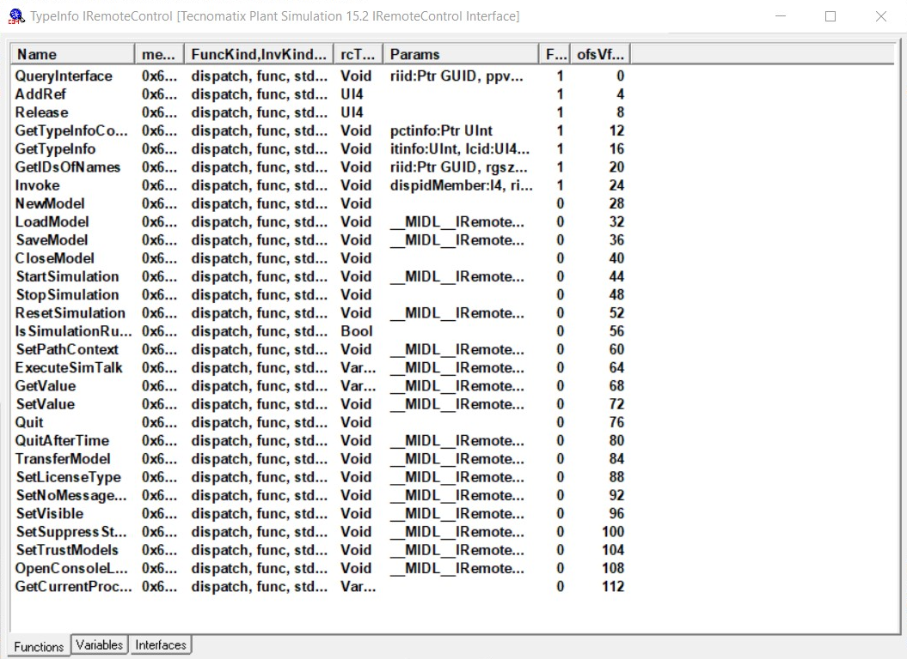

# Plantsim package developer documentation

The connector attaches to Plant Simulation via the COM interface. The following functions are available in the
"IRemoteControl" that Plant Simulation creates:

## Further resources

Plant Simulation documentation of the COM interface:
* https://docs.plm.automation.siemens.com/content/plant_sim_help/15.1/plant_sim_all_in_one_html/en_US/tecnomatix_plant_simulation_help/add_ins_reference_help/inter_process_communication_interfaces/com/com.html

Description on how to listen to events:
* https://community.sw.siemens.com/s/feed/0D54O000061xu1USAQ