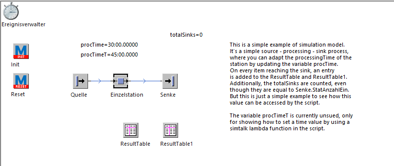

# Example

This directory provides an example of a simple simulation to show how variables could be set,
the simulation could be controlled and results in variables and tables could be fetched.

The simulation model was created in PlantSimulation 16.1.6.

## Simulation model
This is a simple example of simulation model.
It's a simple source - processing - sink process,
where you can adapt the processingTime of the
station by updating the variable procTime.
On every item reaching the sink, an entry
is added to the ResultTable and ResultTable1.
Additionally, the totalSinks are counted, even
though they are equal to Senke.StatAnzahlEin.
But this is just a simple example to see how this 
value can be accessed by the script.

The variable procTimeT is currently unsued, only
for showing how to set a time value by using a 
simtalk lambda function in the script.

## Usage
Ensure you've installed the ``plantsim``-package before executing the examples, e.g. using pip.  
Afterwards just run the example.py.